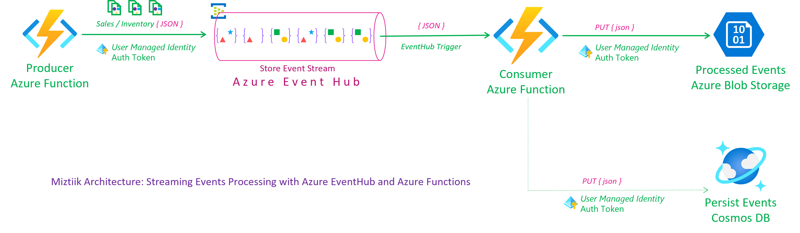
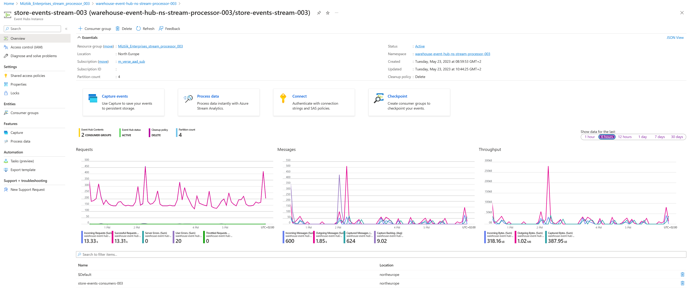
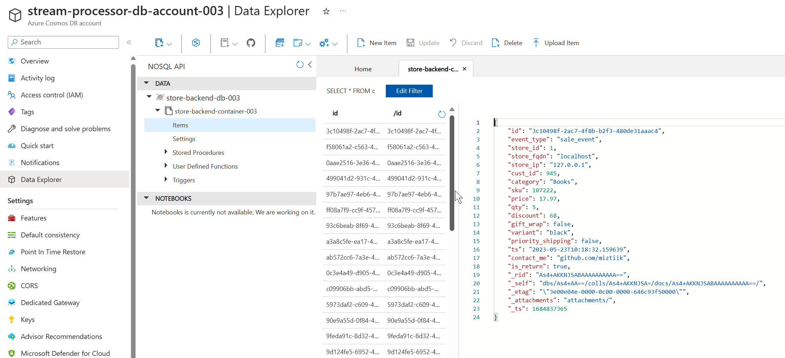
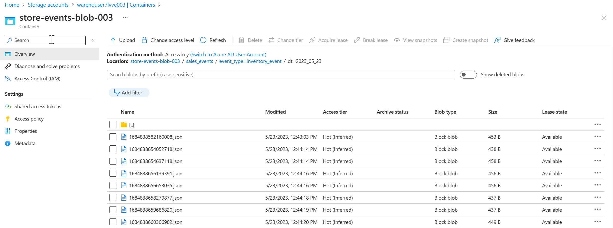
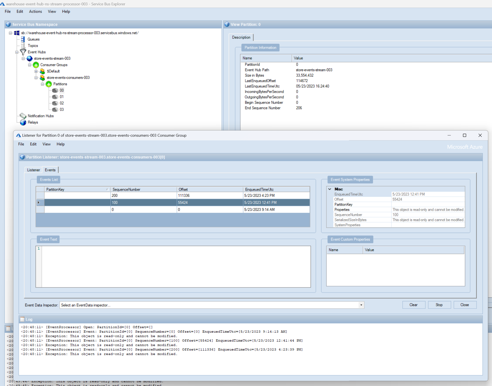

# Event Streaming with Azure Event Hub

Mystique enterprise's stores generate numerous sales and inventory events across multiple locations. To efficiently handle this data and enable further processing, Mystique enterprise requires a solution for data ingestion and centralized storage.

Additionally, Mystique enterprise needs the ability to selectively process events based on specific properties. They are interested in filtering events classified as `sale_event` or `inventory_event`. This selective processing helps them focus on relevant data for analysis and decision-making. Furthermore, Mystique enterprise wants to apply an additional filter by considering events with a discount greater than `20`. This filter is crucial for analyzing key business metrics, such as `total_sales` and `total_discounts`, as well as detecting potential fraudulent activity.

Below is a sample of their event. How can we assist them?

```json
{
  "id": "743da362-69df-4e63-a95f-a1d93e29825e",
  "request_id": "743da362-69df-4e63-a95f-a1d93e29825e",
  "store_id": 5,
  "store_fqdn": "localhost",
  "store_ip": "127.0.0.1",
  "cust_id": 549,
  "category": "Notebooks",
  "sku": 169008,
  "price": 45.85,
  "qty": 34,
  "discount": 10.3,
  "gift_wrap": true,
  "variant": "red",
  "priority_shipping": false,
  "ts": "2023-05-19T14:36:09.985501",
  "contact_me": "github.com/miztiik",
  "is_return": true
}
```

Event properties,

```json
{
   "event_type":"sale_event",
   "priority_shipping":false,
}
```

 Can you provide guidance on how to accomplish this?

## 🎯 Solution

To meet their needs, Mystique enterprise has chosen [Azure Event Hub][1] as the platform of choice. It provides the necessary capabilities to handle the ingestion and storage of the data. We can utilize the [capture streaming events][2] capability of Azure Event Hub to persist the message to Azure Blob Storage. This allows us to store the data in a central location for archival needs. Additionally, we can leverage the [partitioning][5] feature of Azure Event Hub to segregate the events based on specific criteria. This allows us to focus on relevant data for analysis and decision-making.

**Event Producer**: To generate events, an Azure Function with a managed identity will send them to an event hub within a designated event hub namespace. The event hub is configured with `4` subscriptions, and we can utilize partitions to segregate events based on the `event_type` property. For instance, `sale_events` and `inventory_events` can be directed to different partitions. This partitioning enables us to process events based on specific criteria, allowing us to filter events based on the partition_id. By doing so, we can focus on relevant data for analysis and decision-making.

**Event Consumer**: To process the incoming events, a consumer function is set up with an event hub trigger, specifically targeting a consumer group. This consumer function efficiently handles and persists these events to an Azure Storage Account and Cosmos DB. To ensure secure and controlled access to the required resources, a scoped managed identity with RBAC (Role-Based Access Control) permissions is utilized. This approach allows for granular control over access to resources based on assigned roles. Furthermore, the trigger connection itself is authenticated using a managed identity. This ensures that only authorized entities can interact with the event hub, enhancing the overall security of the system.

_**Note**: If you do not intend to process all events and only want to consume a subset of events, it is recommended to avoid using event hub triggers for your function. Instead, opt for a pull mechanism where you can configure event pulling using the SDK (Software Development Kit) of your choice (not covered here). This allows you to selectively retrieve events only from specific partitions, providing more control over the event consumption process._

By leveraging the capabilities of Bicep, all the required resources can be easily provisioned and managed with minimal effort. Bicep simplifies the process of defining and deploying Azure resources, allowing for efficient resource management.



1. ## 🧰 Prerequisites

   This demo, along with its instructions, scripts, and Bicep template, has been specifically designed to be executed in the `northeurope` region. However, with minimal modifications, you can also try running it in other regions of your choice (the specific steps for doing so are not covered in this context)

   - 🛠 Azure CLI Installed & Configured - [Get help here](https://learn.microsoft.com/en-us/cli/azure/install-azure-cli)
   - 🛠 Azure Function Core Tools - [Get help here](https://learn.microsoft.com/en-us/azure/azure-functions/functions-run-local?tabs=v4%2Cwindows%2Ccsharp%2Cportal%2Cbash#install-the-azure-functions-core-tools)
   - 🛠 Bicep Installed & Configured - [Get help here](https://learn.microsoft.com/en-us/azure/azure-resource-manager/bicep/install)
     - 🛠 [Optional] VS Code & Bicep Extenstions - [Get help here](https://learn.microsoft.com/en-us/azure/azure-resource-manager/bicep/install#vs-code-and-bicep-extension)
   - `jq` - [Get help here](https://stedolan.github.io/jq/download/)
   - `bash` or git bash - [Get help here](https://git-scm.com/downloads)

1. ## ⚙️ Setting up the environment

   - Get the application code

     ```bash
     git clone https://github.com/miztiik/azure-event-hub-stream-processor.git
     cd azure-event-hub-stream-processor
     ```

1. ## 🚀 Prepare the local environment

   Ensure you have jq, Azure Cli and bicep working

   ```bash
   jq --version
   func --version
   bicep --version
   bash --version
   az account show
   ```

1. ## 🚀 Deploying the Solution

   - **Stack: Main Bicep**
     We will create the following resources
     - **Storage Accounts** for storing the events
       - General purpose Storage Account - Used by Azure functions to store the function code
       - `warehouse*` -  Azure Function will store the events here
     - **Event Hub Namespace**
       - Event Hub Stream, with `4` Partitions
         - Even Partitions - `0` & `2` - `inventory_Event`
         - Odd Partitions - `1` & `3` - `sale_event`
         - Event Hub Capture - Enabled
           - Events will be stored in `warehouse*` storage account.
     - **Managed Identity**
        - This will be used by the Azure Function to interact with the service bus
     - **Python Azure Function**
        - **Producer**: `HTTP` Trigger. Customized to send `count` number of events to the service bus, using parameters passed in the query string. `count` defaults to `10`
        - **Consumer**: `eventHubTrigger` trigger for a specific consumer group. It is configured to receive `1` event at a time. you can change binding configuration `cardinality` to `many` to receive an array of events.
     - _Note: There are few additional resources created, but you can ignore them for now, they aren't required for this demo, but be sure to clean them up later_

      Initiate the deployment with the following command,

      ```bash
      # make deploy
      sh deployment_scripts/deploy.sh
      ```

      After successfully deploying the stack, Check the `Resource Groups/Deployments` section for the resources.

      

1. ## 🔬 Testing the solution

   - **Trigger the function**

      ```bash
      FUNC_URL="https://stream-processor-store-backend-fn-app-003.azurewebsites.net/store-events-producer-fn"
      curl ${FUNC_URL}?count=10
      ```

      You should see an output like this,

      ```json
      {
      "miztiik_event_processed": true,
      "msg": "Generated 10 messages",
      "resp": {
         "status": true,
         "tot_msgs": 10,
         "bad_msgs": 3,
         "sale_evnts": 5,
         "inventory_evnts": 5,
         "tot_sales": 482.03
      },
      "count": 10,
      "last_processed_on": "2023-05-23T16:23:16.949855"
      }
      ```

      During the execution of this function, a total of 10 messages were produced, with 4 of them being classified as `sale_events` and 6 of them as `inventory_events`. Please note that the numbers may vary for your specific scenario if you run the producer function multiple times.

      Additionally, when observing the storage of events in Blob Storage, you will notice that inventory_events are stored in blob prefixes either labeled as `0` or `2`, while `sale_events` are stored in blob prefixes labeled as either `1` or `3`. This configuration is a result of setting up the event hub to utilize 4 partitions, with 2 partitions allocated for each event type.

      
      
      

      You can also use the [Service Bus Hub Explorer Tool][4] to view the events in the event hub.

      

1. ## 📒 Conclusion

   In this demonstration, we showcase a streamlined process for event streaming ingestion with Azure Event Hub and stream processing with Azure Functions. This allows for optimized event processing and enables targeted handling of events based on specific criteria, facilitating seamless downstream processing with the use of _consumer groups_ or _partition_id_ filters or _event properties_.
  
1. ## 🧹 CleanUp

   If you want to destroy all the resources created by the stack, Execute the below command to delete the stack, or _you can delete the stack from console as well_

   - Resources created during [Deploying The Solution](#-deploying-the-solution)
   - _Any other custom resources, you have created for this demo_

   ```bash
   # Delete from resource group
   az group delete --name Miztiik_Enterprises_xxx --yes
   # Follow any on-screen prompt
   ```

   This is not an exhaustive list, please carry out other necessary steps as maybe applicable to your needs.

## 📌 Who is using this

This repository aims to show how to Bicep to new developers, Solution Architects & Ops Engineers in Azure.

### 💡 Help/Suggestions or 🐛 Bugs

Thank you for your interest in contributing to our project. Whether it is a bug report, new feature, correction, or additional documentation or solutions, we greatly value feedback and contributions from our community. [Start here](/issues)

### 👋 Buy me a coffee

[](https://ko-fi.com/Q5Q41QDGK) Buy me a [coffee ☕][900].

### 📚 References

1. [Azure Docs - Event Hub][1]
1. [Azure Docs - Stream Analytics Aggregation function][2]
1. [Azure Docs - Event Hub Python Samples][3]
1. [Azure Docs - Event Hub Explorer Tool][4]
1. [Azure Docs - Event Hub Partitions][5]
1. [Azure Docs - Managed Identity][8]
1. [Azure Docs - Managed Identity Caching][9]
1. [Gitub Issue - Default Credential Troubleshooting][10]
1. [Gitub Issue - Default Credential Troubleshooting][11]

[1]: https://learn.microsoft.com/en-us/azure/event-hubs
[2]: https://learn.microsoft.com/en-us/stream-analytics-query/aggregate-functions-azure-stream-analytics
[3]: https://github.com/Azure/azure-sdk-for-python/blob/main/sdk/eventhub/azure-eventhub/samples
[4]: https://techcommunity.microsoft.com/t5/azure-paas-blog/how-to-verify-if-azure-event-hub-partition-is-working-by-using/ba-p/3032371
[5]: https://learn.microsoft.com/en-us/azure/architecture/reference-architectures/event-hubs/partitioning-in-event-hubs-and-kafka
[8]: https://learn.microsoft.com/en-us/azure/active-directory/managed-identities-azure-resources/overview
[9]: https://learn.microsoft.com/en-us/azure/app-service/overview-managed-identity?tabs=portal%2Chttp#configure-target-resource
[10]: https://github.com/microsoft/azure-container-apps/issues/442
[11]: https://github.com/microsoft/azure-container-apps/issues/325#issuecomment-1265380377

### 🏷️ Metadata


**Level**: 200

[100]: https://www.udemy.com/course/aws-cloud-security/?referralCode=B7F1B6C78B45ADAF77A9
[101]: https://www.udemy.com/course/aws-cloud-security-proactive-way/?referralCode=71DC542AD4481309A441
[102]: https://www.udemy.com/course/aws-cloud-development-kit-from-beginner-to-professional/?referralCode=E15D7FB64E417C547579
[103]: https://www.udemy.com/course/aws-cloudformation-basics?referralCode=93AD3B1530BC871093D6
[899]: https://www.udemy.com/user/n-kumar/
[900]: https://ko-fi.com/miztiik
[901]: https://ko-fi.com/Q5Q41QDGK