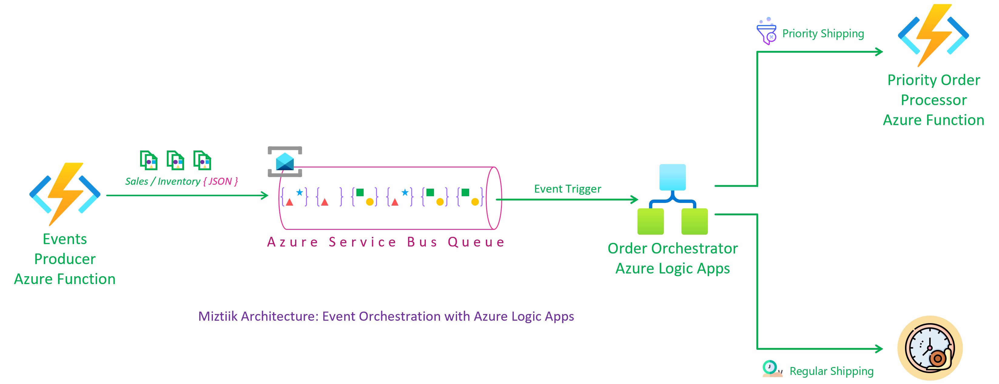
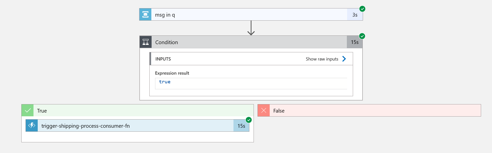
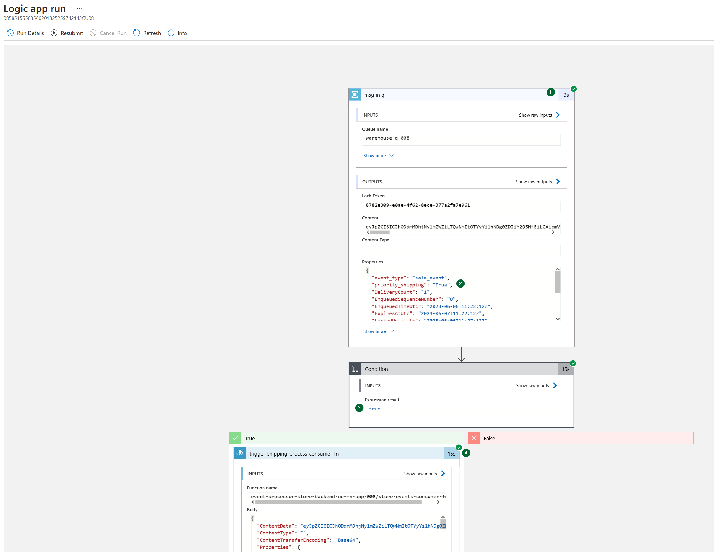
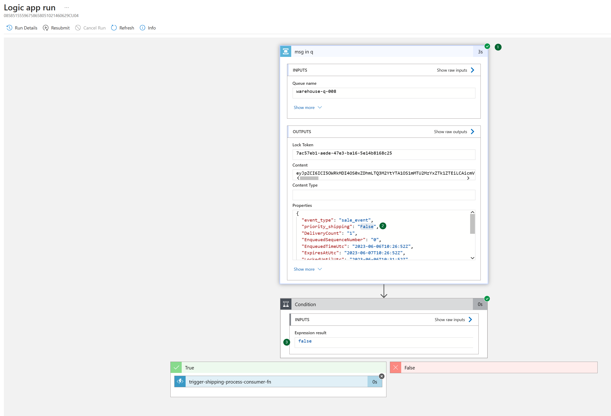

# Event Orchestration with Azure Logic Apps

Mystique enterprise's stores generate numerous sales and inventory events across multiple locations. They want to process order that have `priority_shipping` enabled. Below is a sample of their event.

```json
{
  "id": "743da362-69df-4e63-a95f-a1d93e29825e",
  "request_id": "743da362-69df-4e63-a95f-a1d93e29825e",
  "store_id": 5,
  "store_fqdn": "localhost",
  "store_ip": "127.0.0.1",
  "cust_id": 549,
  "category": "Notebooks",
  "sku": 169008,
  "price": 45.85,
  "qty": 34,
  "discount": 10.3,
  "gift_wrap": true,
  "variant": "red",
  "priority_shipping": false,
  "ts": "2023-05-19T14:36:09.985501",
  "contact_me": "github.com/miztiik",
  "is_return": true
}
```

Event properties,

```json
{
   "event_type":"sale_event",
   "priority_shipping":false,
}
```

 Can you provide guidance on how to accomplish this?

## 🎯 Solution

To meet their needs, Lets use Azure Logic Apps to trigger an workflow based on message attrbutes.



By leveraging the capabilities of Bicep, all the required resources can be easily provisioned and managed with minimal effort. Bicep simplifies the process of defining and deploying Azure resources, allowing for efficient resource management.

1. ## 🧰 Prerequisites

   This demo, along with its instructions, scripts, and Bicep template, has been specifically designed to be executed in the `northeurope` region. However, with minimal modifications, you can also try running it in other regions of your choice (the specific steps for doing so are not covered in this context)

   - 🛠 Azure CLI Installed & Configured - [Get help here](https://learn.microsoft.com/en-us/cli/azure/install-azure-cli)
   - 🛠 Azure Function Core Tools - [Get help here](https://learn.microsoft.com/en-us/azure/azure-functions/functions-run-local?tabs=v4%2Cwindows%2Ccsharp%2Cportal%2Cbash#install-the-azure-functions-core-tools)
   - 🛠 Bicep Installed & Configured - [Get help here](https://learn.microsoft.com/en-us/azure/azure-resource-manager/bicep/install)
     - 🛠 [Optional] VS Code & Bicep Extenstions - [Get help here](https://learn.microsoft.com/en-us/azure/azure-resource-manager/bicep/install#vs-code-and-bicep-extension)
   - `jq` - [Get help here](https://stedolan.github.io/jq/download/)
   - `bash` or git bash - [Get help here](https://git-scm.com/downloads)

1. ## ⚙️ Setting up the environment

   - Get the application code

     ```bash
     git clone https://github.com/miztiik/azure-logic-app-event-processor.git
     cd azure-logic-app-event-processor
     ```

1. ## 🚀 Prepare the local environment

   Ensure you have jq, Azure Cli and bicep working

   ```bash
   jq --version
   func --version
   bicep --version
   bash --version
   az account show
   ```

1. ## 🚀 Deploying the Solution

   - **Stack: Main Bicep**
     We will create the following resources
     - **Storage Accounts** for storing the events
       - General purpose Storage Account - Used by Azure functions to store the function code
       - `warehouse*` -  Azure Function will store the events here
     - **Service Bus Namespace**
       - Store event queue
     - **Managed Identity**
        - This will be used by the Azure Function to interact with the service bus
     - **Python Azure Function**
        - **Producer**: `HTTP` Trigger. Customized to send `count` number of events to the service bus, using parameters passed in the query string. `count` defaults to `10`
        - **Consumer**: Azure Logic App will trigger this function. I did not finish ths code to insert the incoming _base64_ encoded message into blob and cosmos. But the intention is to demo logic apps. so will leave it for future work.

     - _Note: There are few additional resources created, but you can ignore them for now, they aren't required for this demo, but be sure to clean them up later_

      Initiate the deployment with the following command,

      ```bash
      # make all
      # make func
      # make deploy

      sh deployment_scripts/deploy.sh
      ```

      The logicapp requires the consumer function id, but function code update happens outside of bicep deployment, the function is not yet created. So we will (re)deploy the logic app to update the function id.

      ```bash

      After successfully deploying the stack, Check the `Resource Groups/Deployments` section for the resources.

      

2. ## 🔬 Testing the solution

   - **Trigger the function**

      ```bash
      FUNC_URL="https://event-processor-store-backend-ne-fn-app-009.azurewebsites.net/store-events-consumer-fn"
      curl ${FUNC_URL}?count=10
      ```

      You should see an output like this,

      ```json
      {
      "miztiik_event_processed": true,
      "msg": "Generated 10 messages",
      "resp": {
         "status": true,
         "tot_msgs": 10,
         "bad_msgs": 3,
         "sale_evnts": 5,
         "inventory_evnts": 5,
         "tot_sales": 482.03
      },
      "count": 10,
      "last_processed_on": "2023-05-23T16:23:16.949855"
      }
      ```

      During the execution of this function, a total of 10 messages were produced, with 4 of them being classified as `sale_events` and 6 of them as `inventory_events`. Please note that the numbers may vary for your specific scenario if you run the producer function multiple times.

      From the screenshots we can observe events with priority_shipping set to true are being sent to the consumer function.

      
      
      

3. ## 📒 Conclusion

   In this demonstration, we showcase event orchestration with Azure Logic Apps.
  
4. ## 🧹 CleanUp

   If you want to destroy all the resources created by the stack, Execute the below command to delete the stack, or _you can delete the stack from console as well_

   - Resources created during [Deploying The Solution](#-deploying-the-solution)
   - _Any other custom resources, you have created for this demo_

   ```bash
   # Delete from resource group
   az group delete --name Miztiik_Enterprises_xxx --yes
   # Follow any on-screen prompt
   ```

   This is not an exhaustive list, please carry out other necessary steps as maybe applicable to your needs.

## 📌 Who is using this

This repository aims to show how to Bicep to new developers, Solution Architects & Ops Engineers in Azure.

### 💡 Help/Suggestions or 🐛 Bugs

Thank you for your interest in contributing to our project. Whether it is a bug report, new feature, correction, or additional documentation or solutions, we greatly value feedback and contributions from our community. [Start here](/issues)

### 👋 Buy me a coffee

[](https://ko-fi.com/Q5Q41QDGK) Buy me a [coffee ☕][900].

### 📚 References

1. [Azure Docs - Event Hub][1]
1. [Azure Docs - Stream Analytics Aggregation function][2]
1. [Azure Docs - Event Hub Python Samples][3]
1. [Azure Docs - Event Hub Explorer Tool][4]
1. [Azure Docs - Event Hub Partitions][5]
1. [Azure Docs - Managed Identity][8]
1. [Azure Docs - Managed Identity Caching][9]
1. [Gitub Issue - Default Credential Troubleshooting][10]
1. [Gitub Issue - Default Credential Troubleshooting][11]

[1]: https://learn.microsoft.com/en-us/azure/event-hubs
[2]: https://learn.microsoft.com/en-us/stream-analytics-query/aggregate-functions-azure-stream-analytics
[3]: https://github.com/Azure/azure-sdk-for-python/blob/main/sdk/eventhub/azure-eventhub/samples
[4]: https://techcommunity.microsoft.com/t5/azure-paas-blog/how-to-verify-if-azure-event-hub-partition-is-working-by-using/ba-p/3032371
[5]: https://learn.microsoft.com/en-us/azure/architecture/reference-architectures/event-hubs/partitioning-in-event-hubs-and-kafka
[8]: https://learn.microsoft.com/en-us/azure/active-directory/managed-identities-azure-resources/overview
[9]: https://learn.microsoft.com/en-us/azure/app-service/overview-managed-identity?tabs=portal%2Chttp#configure-target-resource
[10]: https://github.com/microsoft/azure-container-apps/issues/442
[11]: https://github.com/microsoft/azure-container-apps/issues/325#issuecomment-1265380377

### 🏷️ Metadata


**Level**: 200

[100]: https://www.udemy.com/course/aws-cloud-security/?referralCode=B7F1B6C78B45ADAF77A9
[101]: https://www.udemy.com/course/aws-cloud-security-proactive-way/?referralCode=71DC542AD4481309A441
[102]: https://www.udemy.com/course/aws-cloud-development-kit-from-beginner-to-professional/?referralCode=E15D7FB64E417C547579
[103]: https://www.udemy.com/course/aws-cloudformation-basics?referralCode=93AD3B1530BC871093D6
[899]: https://www.udemy.com/user/n-kumar/
[900]: https://ko-fi.com/miztiik
[901]: https://ko-fi.com/Q5Q41QDGK